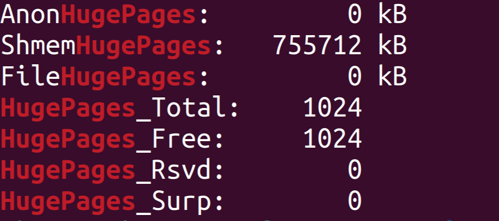
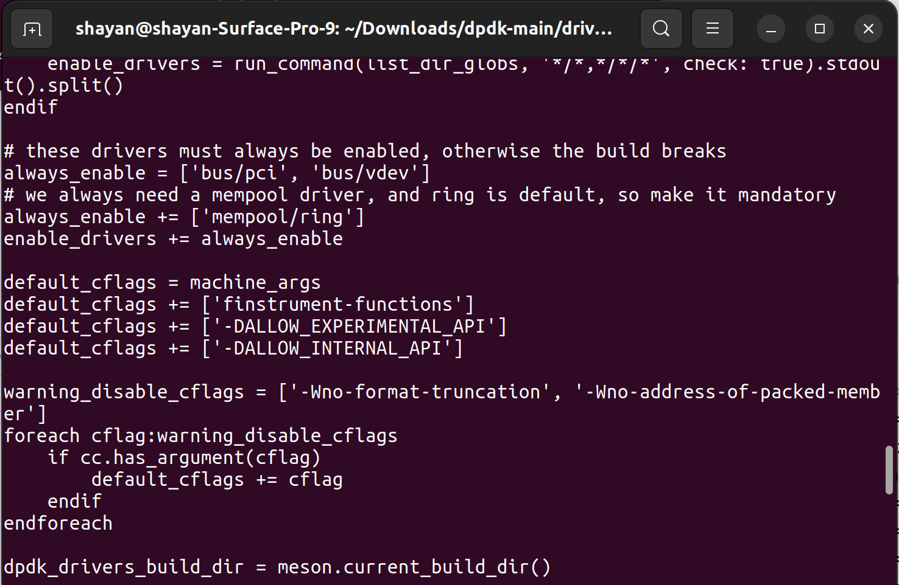
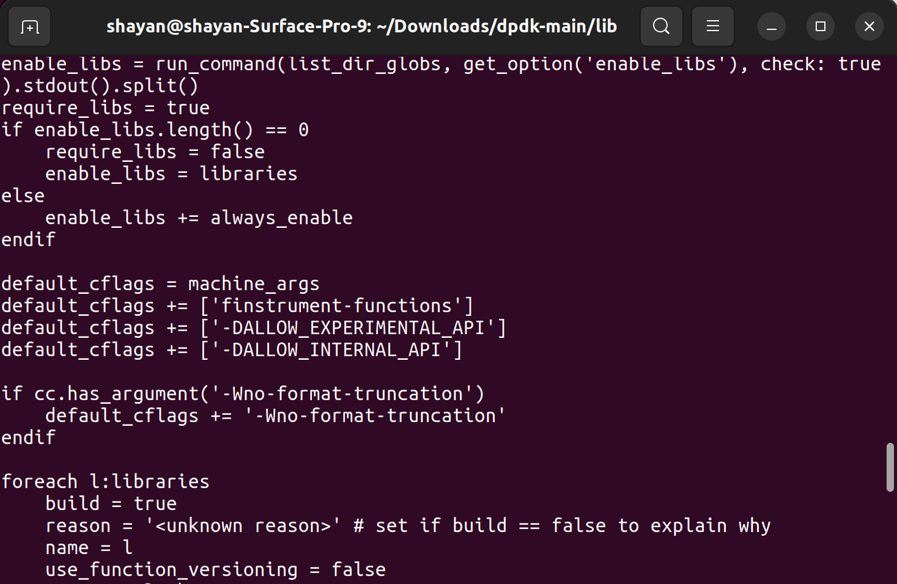

# DPDK Project Report
**Course**: Special Topics in Computer Networks 3

---

## Table of Contents

- [Project Overview](#project-overview)
- [Team Members](#team-members)
- [Tools & Technologies](#tools--technologies)
- [Installation of DPDK](#installation-of-dpdk)
- [Configuring HugePages](#configuring-hugepages)
- [Running the Hello World Example](#running-the-hello-world-example)
- [Implementation Details](#implementation-details)
- [Results & Analysis](#results--analysis)
- [Conclusion](#conclusion)
  
---

## Team Members

- 👤 AmirMohamad Maniei
- 👤 Shayan Moradi
- 👤 AliReza Biria

---
 
## Tools & Technologies

- **Operating System**: Ubuntu 20.04 LTS (or compatible)
- **DPDK**: Integrated with VPP
  - **Meson**: ≥ 1.8.0
  - **Ninja**: ≥ 1.10.0
- **Tracing Tools**:
  - Trace Compass (for LTTng traces)
  - LTTng (≥ 2.13 recommended)
  - ftrace (built-in kernel tracer)
  - perf (from `linux-tools`, version matching kernel)
- **Dependencies**:
  - `libnuma-dev`
  - `libpcap-dev`
  - `python3-pyelftools`
  - `ninja-build`
  - `python3-pip`

---

## Installation of DPDK

1. **Update repositories and install dependencies:**

    ```bash
    sudo apt update
    sudo apt install -y meson ninja-build python3-pyelftools build-essential
    ```

2. **Clone the DPDK repository:**

    ```bash
    git clone https://github.com/DPDK/dpdk.git
    ```

3. **Build and install DPDK:**

    ```bash
    cd dpdk
    meson setup build
    cd build
    ninja
    sudo ninja install
    sudo ldconfig
    ```
  


---
  


## Configuring HugePages

Allocate 1024 hugepages for DPDK:

```bash
echo 1024 | sudo tee /proc/sys/vm/nr_hugepages
cat /proc/meminfo | grep HugePages
```



---

  


## Running the Hello World Example

Build and run the `helloworld` example provided by DPDK:

```bash
cd dpdk
meson configure -Dexamples=helloworld
ninja -C build
sudo ./build/examples/dpdk-helloworld
```
  

  
---

## memif

```
./<build_dir>/app/dpdk-testpmd -l 0-1 --proc-type=primary --file-prefix=pmd1 --
vdev=net_memif,role=server -- -i
```

```
./<build_dir>/app/dpdk-testpmd -l 2-3 --proc-type=primary --file-prefix=pmd2 --vdev=net_memif -- -i
```

  

**Client :**

```
testpmd> start tx_first
```

**Server :**

```
testpmd> start
```

**both :**

```
testpmd> show port stats 0
```

  

**Server :**

  


  

**Client :**


  

---

  

## lttng function tracing

  

To enable tracing with LTTng, specific compiler flags -finstrument-functions must be set in the default_cflags for both the driver and library build configurations.

  
  





  

</br>

then :
  

```
lttng create session
lttng enable-event --userspace --all
lttng add-context --userspace --type=vpid --type=vtid --type=procname
lttng start
```

  

**in Server Terminal :**

```
sudo LD_PRELOAD=/usr/lib/x86_64-linux-gnu/liblttng-ust-cyg-profile.so ./app/dpdk-testpmd -l 0-1 --proc-type=primary --file-prefix=pmd1 --vdev=net_memif,role=server -- -i

```

  

**in Client Terminal :**

```
sudo LD_PRELOAD=/usr/lib/x86_64-linux-gnu/liblttng-ust-cyg-profile.so ./app/dpdk-testpmd -l 2-3 --proc-type=primary --file-prefix=pmd2 --vdev=net_memif -- -i

```

</br>

**Client :**

```
testpmd> start tx_first
```

**Server :**

```
testpmd> start
```

**both :**

```
testpmd> show port stats 0
```


  

```
lttng stop
lttng destroy
```

  

---

## Analysis

  

### 🔥 **Flame Graph Analysis**

  


  

The flame graph reveals a structured and repetitive execution pattern in a network-processing application. The top-level function `pkt_burst_io_forward` dominates runtime, indicating it's the primary performance bottleneck. Functions like `common_fwd_stream_receive`, `rte_eth_rx_burst`, and `eth_memif_rx` appear consistently beneath it, reflecting their role in packet handling and forwarding. The repeated call stacks suggest steady, burst-based traffic processing. Deeper, short-lived functions likely handle utilities or parsing. Optimization should focus on `pkt_burst_io_forward` and its direct callees to achieve the most significant performance gains.

  

---

### 📊 **Counters Analysis Summary**

  


  

The **Counters** tab in Trace Compass tracks thread-level metrics like `cache_misses`, `CPU usage`, and `instructions` for threads `37211`, `37215`, `37228`, and `37232` over a 68 ms window.

  

#### **Key Findings**

  

-  **Thread 37211** shows the highest activity (~2.4 million), indicating it's likely CPU-bound or running critical tasks.

- Other threads (~600k) show much lower usage — likely idle, blocked, or performing background tasks.

-  **Spikes align with vertical markers**, suggesting timed or burst operations.

  

#### **Insights & Recommendations**

  

- Thread 37211 is the main load carrier — investigate its role.

- Other threads may be underutilized — check for blocking or synchronization issues.

- Consider **load balancing** or parallelization to improve efficiency.

  


  

Explanation of Peaks in lttng_ust_cyg_profile:func_entry and func_exit Events:

  

The peaks observed in the lttng_ust_cyg_profile:func_entry and func_exit counters correspond to rapid bursts of function calls within user-space threads. These events are automatically generated by LTTng-UST's function tracing and indicate entry and exit points of functions. High-frequency peaks often signal performance-critical sections, such as tight loops or intensive packet processing. In the context of DPDK-based applications (as shown in the trace), such peaks typically occur during continuous polling and data transmission/reception cycles, reflecting the heavy use of functions like rte_eth_rx_burst or memif_get_ring_from_queue.

  
  

---

  

### 🔢 **Statistics Overview (Counters)**

  


  

This view is showing aggregated counter data for the trace source `ust/uid/0/64-bit`.

  

#### 🔸 Columns:

  

-  **Level**: The trace source path (`ust/uid/0/64-bit`), representing the user-space tracing session for user ID 0 and architecture 64-bit.

-  **Events total**: Total number of recorded events in the entire trace: `22,785,417`.

-  **Events in selection**: Number of events in the currently selected time window or range: `1,215,466`.

  

----------

  

### 📊 **Pie Charts Analysis**

  


  

There are two pie charts:

  

1.  **Global**: Event distribution across all recorded data.

2.  **Events in selection**: Event distribution within the currently selected time interval.

  

`lttng_ust_cyg_profile:func_exit`

  

`lttng_ust_cyg_profile:func_entry`

  

These two events are standard function tracing probes inserted by LTTng-UST using `cyg-profile`:

  

-  `func_entry`: Marks when a function is entered.

-  `func_exit`: Marks when a function returns.

  

The pie charts are almost 50/50 between `func_entry` and `func_exit`, indicating that for most function calls, there's a matching exit — a good sign of consistent tracing without dropped or unmatched events.

  

There are also minor slices for “Others,” which may include rare or user-defined events.

  

---

  

### 🌳 **Weighted Tree Viewer Analysis**

  


  

This view shows a _call tree_ of nested functions with **total** and **self-time** metrics to help spot performance bottlenecks.

  

#### Key Columns:

  

**Function Tree (Leftmost)**

Functions are shown in hierarchy (e.g., `rte_memcpy` ← `eth_memif_rx` ← `rte_eth_rx_burst`).

  


  

**Duration**

Total time including child calls:

  

-  `pkt_burst_io_forward` → **1.275 s**

-  `common_fwd_stream_receive` → **927.75 ms**

  

**Self time**

Time spent in the function itself:

  

-  `rte_trace_point_fp_is_enabled` → **491.605 µs**

-  `memif_get_ring_from_queue` → **26.649 ms**

  

**Active CPU time**

All values are zero — wall-clock time used instead of CPU samples.

  

**Number of calls**

Example counts:

  

-  `rte_eth_rx_burst` → **259.8k**

-  `rte_memcpy`, `rte_pktmbuf_reset` → **154.1k**

  

#### Insights:

  

-  `pkt_burst_io_forward` consumes most time.

-  `rte_memcpy` is frequent and expensive — potential optimization point.

- High self-time + high call count = likely performance hotspot.

  

---

  
  

### 📊 Function Duration Distribution: Summary

  


  

#### **Left Panel (Table View)**

  

Lists individual function calls with precise **start/end times**, **duration**, and **thread ID** (TID = 372). Useful for drilling into specific execution patterns or anomalies.

  

#### **Right Panel (Histogram View)**

  

Shows a **duration vs. frequency** histogram:

  

-  **Multi-modal peaks** suggest different code paths or workloads (e.g., fast vs. slow paths).

-  **Main peak (~5–10 µs)** reflects frequent, fast executions (likely tight loops).

-  **Secondary peaks (20–120 µs)** may involve memory operations or brief blocking.

-  **Sparse tail beyond 120 µs** suggests rare long-latency calls (e.g., initialization).

-  **Logarithmic Y-axis** helps visualize both common and rare durations.

  

#### **Key Insights**

  

- Most calls are short (<20 µs), indicating efficient processing.

- Multiple duration clusters reveal workload variability.

- Filtering by thread (TID) supports focused performance tuning.

- Longer-duration peaks may highlight optimization opportunities.

  

---

### 📊 Flame Chart

  

The **Flame Chart** offers a time-based view of function execution for thread **37232**, revealing a pattern of rapid, low-latency operations. Functions like `pkt_burst_io_forward`, `common_fwd_stream_receive`, and `rte_eth_rx_burst` dominate a critical interval (**16:38:51.620–16:38:51.680**), showing the packet processing loop in action. The frequent presence of `__rte_ethdev_trace_rx_burst_empty` indicates polling behavior. A specific trace shows a short-lived function (~32.8 µs), reflecting the system's fine-grained execution. Overall, the chart confirms a CPU-bound, high-throughput workload with tight loops and minimal idle time—characteristics typical of optimized DPDK environments.

  

- Thread: **37232**

- Time Window: `16:38:51.620` → `16:38:51.680`

- Dominant functions:

-  `pkt_burst_io_forward`

-  `common_fwd_stream_receive`

-  `rte_eth_rx_burst`

  

Nested calls & repetition show high-frequency, low-latency processing loop.

  

---

  

### 📋 Descriptive Statistics

  
  

The **Descriptive Statistics** view highlights which functions dominate execution time. Functions like `__rte_ethdev_trace_rx_burst_empty` and `pkt_burst_io_forward` are called frequently but are lightweight, while `common_fwd_stream_transmit` and `eth_memif_tx` have fewer calls yet high total durations. Memory management functions also contribute notable overhead. This mix of fast polling and heavier processing reveals key optimization targets in the application's packet processing path.

  
  

| Function | Calls | Avg Duration | Total Time |

|-------------------------------------|-------|--------------|------------|

| `__rte_ethdev_trace_rx_burst_empty` | 509k | 513 ns | 261 ms |

| `common_fwd_stream_transmit` | 11k | 60.8 µs | 666 ms |

| `eth_memif_tx` | 10k | 59.8 µs | 655 ms |

| `pkt_burst_io_forward` | 520k | 4.8 µs | **2.5 s** |

  

Insight: `pkt_burst_io_forward` dominates total runtime.

  
  

---

  

## 📈 Progress Summary

✅ Configured hugepages, built DPDK

✅ Ran `helloworld` & `testpmd` with Memif

✅ Integrated LTTng with `cyg-profile`

✅ Performed full trace analysis in Trace Compass

🔧 Remaining: Final test cases + optimization + documentation

  

---

  

## 🧩 Challenges & Solutions

  

**Problem:**

VM-based Ubuntu showed only ~200 LTTng events → unusable trace data.

  

**Solution:**

Switched to dual-boot native Ubuntu → full, accurate tracing with millions of events.
